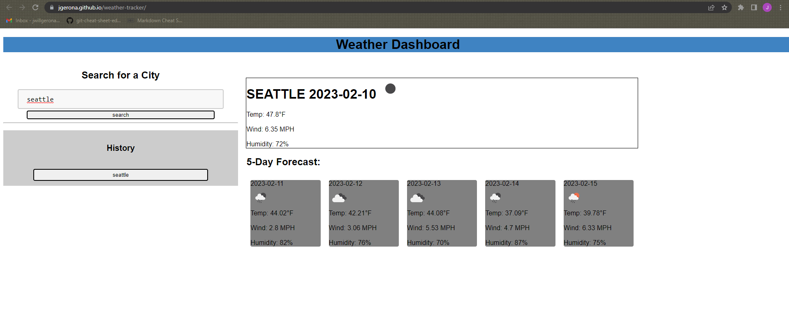

# <weather-tracker>
A webpage that finds the weather forecast of a desired city through an api

## Description

A webpage that finds the weather forecast of a desired city. Utilizing HTML, CSS, JavaScript and Server-Side APIs. It is capable of storing a history of searched cities, then creating a quick button to research the weather of that city. 
## Assets

The following image is a preview of the web application's appearance.

You can use this [link](https://jgerona.github.io/weather-tracker/) to access the page.